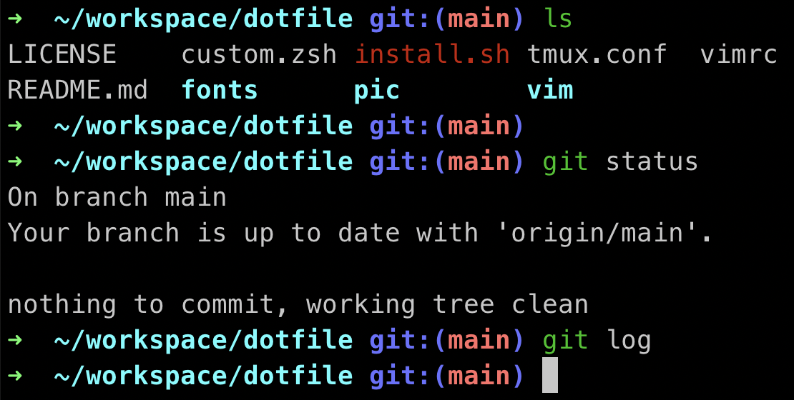
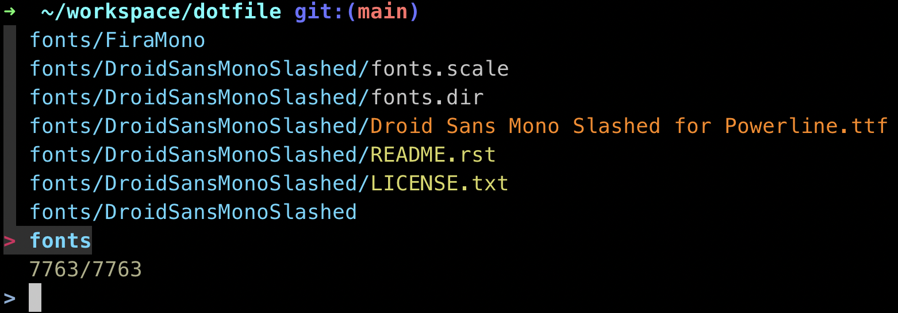
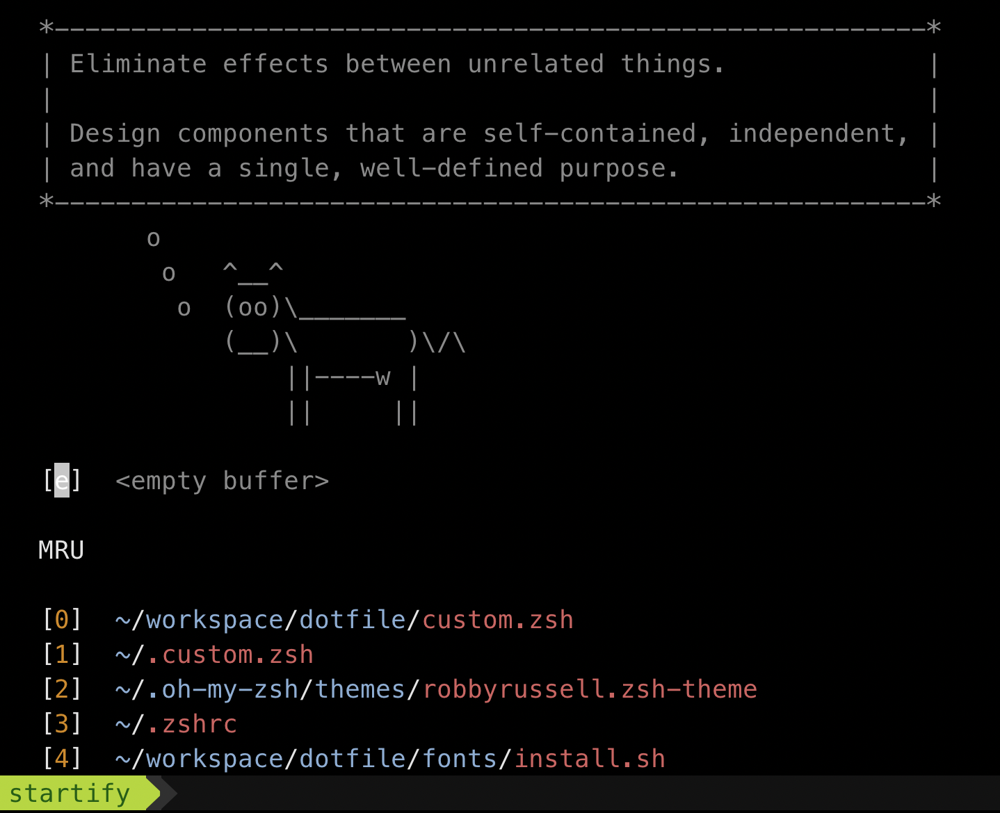
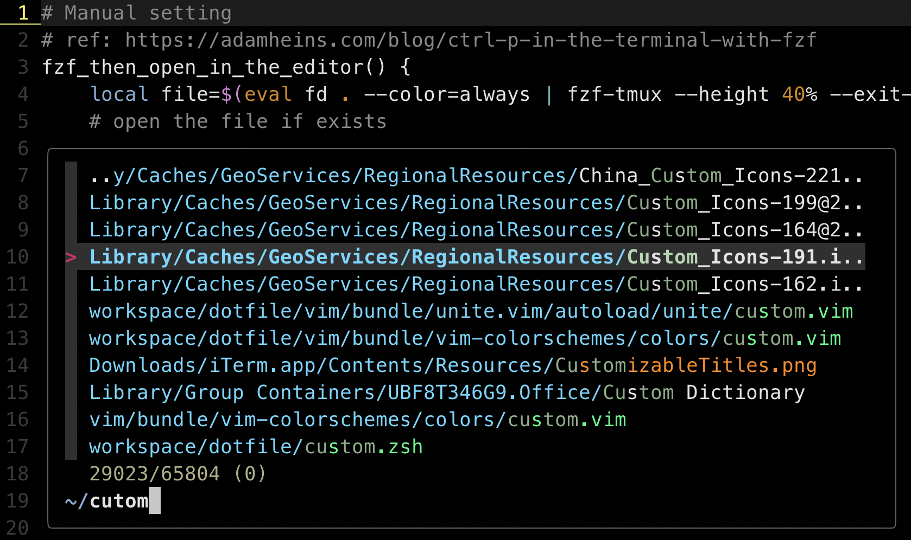

# **dotfile**

# Installation (Suppose using MacOS)
```
git clone https://github.com/wty1143/dotfile.git
```
```
git submodule update --init --recursive
```
---
## zsh shell

## zsh + fzf

## fonts
``` zsh
# ref https://github.com/powerline/fonts.git
cd dotfile/fonts
./install.sh
# After installation complete, go the preference to set the font
# In my example, I use the Meslo LG M on PowerShell
```

## git
```zsh
# ref: https://coderwall.com/p/euwpig/a-better-git-log
git config --global alias.lg "log --color --graph --pretty=format:'%Cred%h%Creset -%C(yellow)%d%Creset %s %Cgreen(%cr) %C(bold blue)<%an>%Creset' --abbrev-commit"
```

## Oh My Zsh
```zsh
# ref: https://gist.github.com/DukeNgn/9312a65e1535b3b1bffd9fed2c892079
sh -c "$(curl -fsSL https://raw.githubusercontent.com/robbyrussell/oh-my-zsh/master/tools/install.sh)"
```

## FZF
```zsh
brew install fzf

# To install useful key bindings and fuzzy completion:
$(brew --prefix)/opt/fzf/install

# After the command above, source to take effect
source ~/.zshrc
```

## Oh my Zsh (default plugin)
```zsh
# https://www.zhihu.com/question/49284484
vim ~/.zshrc
# Fill the plugin you want, ... represent other Zsh plugins you may have installed.
plugin=(... git extract gitignore cp z command-not-found sudo)
```

## Oh My Zsh (third-party plugin)
```zsh
# ref: https://github.com/zsh-users/zsh-autosuggestions/blob/master/INSTALL.md
git clone https://github.com/zsh-users/zsh-autosuggestions ~/.oh-my-zsh/custom/plugins/zsh-autosuggestions

# ref: https://github.com/zsh-users/zsh-syntax-highlighting/blob/master/INSTALL.md
git clone https://github.com/zsh-users/zsh-syntax-highlighting.git ~/.oh-my-zsh/custom/plugins/zsh-syntax-highlighting

vim ~/.zshrc
# ... represent other Zsh plugins you may have installed.
plugin=(... zsh-autosuggestions zsh-syntax-highlighting)
```

## Prepare .fdignore if you don't want to ignore when searching
```zsh
gi python > ~/.fdignore
```

## vim welcome message

## vim + fzf


## tmux & fzf & custom options (One-shot)

### Use the one shot version, suppose the oh my zsh is installed
```zsh
cd dotfile
./install.sh
```

## tmux & fzf & custom options (Manual)

### Prepare the dot file in the home directory
```zsh
# Tmux version >=  2.1 
cd dotfile
# The default prefix is Ctrl+A
ln -s -f $PWD/tmux.conf ~/.tmux.conf
# Add some custom function ex: Ctrl+P
ln -s -f $PWD/custom.zsh ~/.custom.zsh
```
### Add this to ~/.zshrc
```zsh
source ~/.custom.zsh
```

### Vim settings
```zsh
cd dotfile

ln -s -f $PWD/vimrc ~/.vimrc

ln -s -f $PWD/vim ~/.vim

# ref: https://galea.medium.com/getting-started-with-ctags-vim-on-macos-87bcb07cf6d
# Usually the mac's default ctags is too old, use homebrew to update
brew install ctags
# Add them to ~/.custom.zsh
alias ctags="`brew --prefix`/bin/ctags"
```

## If you see weird characters, try to enable glyphs
Preferences > Profiles > Text > User built-in Powerline glyphs
